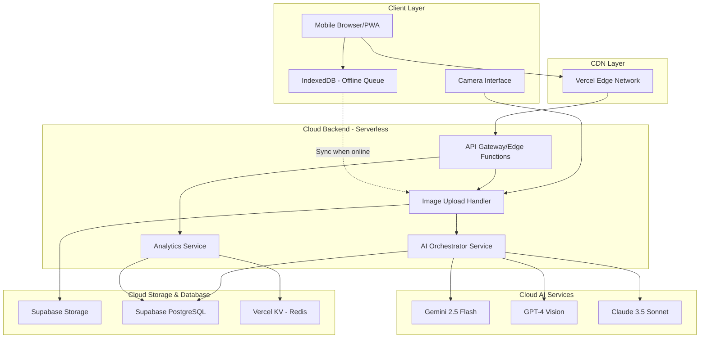

<div align="center">

# 🍉 MelonAI

### Sistem Analisis Kematangan Semangka Berbasis AI Vision

[](https://nextjs.org/)
[](https://www.typescriptlang.org/)
[](https://bun.sh/)
[](https://tailwindcss.com/)
[](LICENSE)

**MelonAI** adalah aplikasi Progressive Web App (PWA) mobile-first yang memanfaatkan cloud computing dan AI vision untuk membantu petani dan pedagang semangka menilai kematangan dan kualitas semangka secara objektif tanpa harus membelahnya.

[Demo](https://melon-ai.vercel.app) • [Dokumentasi](#dokumentasi) • [Roadmap](#roadmap)

</div>

---

## ✨ Fitur Utama

🎯 **Analisis AI Cerdas**
- Deteksi kematangan semangka dengan akurasi tinggi menggunakan multiple AI providers (Gemini, GPT-4, Claude)
- Penilaian tingkat kemanisan (1-10), jenis semangka, dan kualitas kulit
- Fallback otomatis antar AI provider untuk reliability maksimal

📱 **Mobile-First & PWA**
- Desain responsif untuk semua ukuran layar (320px - 428px)
- Installable sebagai aplikasi native di Android/iOS
- Offline mode dengan automatic sync saat koneksi kembali

📊 **Analytics Dashboard**
- Visualisasi tren kematangan dengan charts interaktif
- Filter berdasarkan tanggal, lokasi, dan jenis semangka
- Insights dan rekomendasi berbasis data historis
- Export laporan ke PDF

🌐 **Cloud-Native Architecture**
- Serverless functions di Vercel Edge Network
- Database PostgreSQL dan Storage di Supabase
- Caching dengan Vercel KV (Redis)
- Horizontal scalability untuk 100+ concurrent users

🇮🇩 **User-Friendly untuk Petani**
- Antarmuka dalam Bahasa Indonesia
- Tutorial visual untuk pengguna pertama kali
- Touch targets minimum 44x44px (WCAG compliant)
- Maksimal 3 tap untuk mendapatkan hasil analisis

---

## 🏗️ Arsitektur Sistem



---

## 🚀 Quick Start

### Prerequisites

- [Bun](https://bun.sh/) 1.0+ (JavaScript runtime & package manager)
- [Node.js](https://nodejs.org/) 20.9+ (alternative runtime)
- [Git](https://git-scm.com/)
- Akun [Supabase](https://supabase.com/) (untuk database & storage)
- Akun [Vercel](https://vercel.com/) (untuk deployment)
- API Keys: [Google AI](https://ai.google.dev/), [OpenAI](https://platform.openai.com/), atau [Anthropic](https://www.anthropic.com/)

### Installation

1. **Clone repository**
```bash
git clone https://github.com/feb027/melon-ai.git
cd melon-ai
```

2. **Install dependencies dengan Bun**
```bash
bun install
```

3. **Setup environment variables**
```bash
cp .env.local.example .env.local
```

Edit `.env.local` dengan credentials Anda:
```env
# Supabase
NEXT_PUBLIC_SUPABASE_URL=your_supabase_url
NEXT_PUBLIC_SUPABASE_ANON_KEY=your_supabase_anon_key
SUPABASE_SERVICE_ROLE_KEY=your_service_role_key

# AI Providers (minimal 1 required)
GOOGLE_API_KEY=your_gemini_api_key
OPENAI_API_KEY=your_openai_api_key
ANTHROPIC_API_KEY=your_anthropic_api_key

# Vercel KV (optional untuk caching)
KV_URL=your_kv_url
KV_REST_API_URL=your_kv_rest_api_url
KV_REST_API_TOKEN=your_kv_rest_api_token
KV_REST_API_READ_ONLY_TOKEN=your_kv_rest_api_read_only_token
```

4. **Setup Supabase database**
```bash
# Apply migrations
bunx supabase db push

# Generate TypeScript types
bunx supabase gen types typescript --local > lib/database.types.ts
```

5. **Run development server**
```bash
bun run dev
```

Buka [http://localhost:3000](http://localhost:3000) di browser Anda.

---

## 📦 Tech Stack

### Frontend
- **[Next.js 16.0.3](https://nextjs.org/)** - React framework dengan App Router & Server Components
- **[TypeScript 5.1+](https://www.typescriptlang.org/)** - Type-safe JavaScript
- **[Tailwind CSS v4](https://tailwindcss.com/)** - CSS-first utility framework dengan OKLCH colors
- **[shadcn/ui](https://ui.shadcn.com/)** - Accessible UI components (Radix UI + Tailwind)
- **[Zustand](https://zustand-demo.pmnd.rs/)** - Lightweight state management
- **[Dexie.js](https://dexie.org/)** - IndexedDB wrapper untuk offline storage

### Backend & Cloud
- **[Vercel](https://vercel.com/)** - Hosting & Edge Functions
- **[Supabase](https://supabase.com/)** - PostgreSQL database & Storage
- **[Vercel KV](https://vercel.com/docs/storage/vercel-kv)** - Redis caching layer
- **[Vercel AI SDK](https://sdk.vercel.ai/)** - Unified AI provider interface

### AI Providers
- **[Google Gemini 2.5 Flash](https://ai.google.dev/)** - Primary AI provider (fast & cost-effective)
- **[OpenAI GPT-4 Vision](https://platform.openai.com/)** - Secondary provider (high accuracy)
- **[Anthropic Claude 3.5 Sonnet](https://www.anthropic.com/)** - Tertiary provider (advanced reasoning)

### Development Tools
- **[Bun](https://bun.sh/)** - Ultra-fast JavaScript runtime & package manager
- **[Turbopack](https://turbo.build/pack)** - Rust-based bundler (default in Next.js 16)
- **[Vitest](https://vitest.dev/)** - Unit testing framework
- **[Playwright](https://playwright.dev/)** - E2E testing
- **[ESLint](https://eslint.org/)** - Code linting
- **[Prettier](https://prettier.io/)** - Code formatting

---

## 📖 Dokumentasi

### Environment Variables

| Variable | Required | Description | Example |
|----------|----------|-------------|---------|
| `NEXT_PUBLIC_SUPABASE_URL` | ✅ | Supabase project URL | `https://xxx.supabase.co` |
| `NEXT_PUBLIC_SUPABASE_ANON_KEY` | ✅ | Supabase anonymous key | `eyJhbGc...` |
| `SUPABASE_SERVICE_ROLE_KEY` | ✅ | Supabase service role key (server-side) | `eyJhbGc...` |
| `GOOGLE_API_KEY` | ⚠️ | Google Gemini API key | `AIzaSy...` |
| `OPENAI_API_KEY` | ⚠️ | OpenAI API key | `sk-proj-...` |
| `ANTHROPIC_API_KEY` | ⚠️ | Anthropic API key | `sk-ant-...` |
| `KV_URL` | ❌ | Vercel KV URL (optional) | `redis://...` |
| `KV_REST_API_URL` | ❌ | Vercel KV REST API URL | `https://...` |
| `KV_REST_API_TOKEN` | ❌ | Vercel KV REST API token | `xxx` |
| `KV_REST_API_READ_ONLY_TOKEN` | ❌ | Vercel KV read-only token | `xxx` |

⚠️ **Note:** Minimal 1 AI provider API key diperlukan. Sistem akan menggunakan fallback chain jika multiple providers dikonfigurasi.

### API Endpoints

#### POST `/api/upload`
Upload gambar semangka ke cloud storage.

**Request:**
```typescript
Content-Type: multipart/form-data

{
  image: File // JPEG/PNG, max 2MB
}
```

**Response:**
```typescript
{
  success: true,
  data: {
    imageUrl: "https://storage.supabase.co/...",
    storagePath: "user_id/timestamp-filename.jpg"
  }
}
```

#### POST `/api/analyze`
Analisis gambar semangka menggunakan AI.

**Request:**
```typescript
{
  imageUrl: string,
  userId?: string,
  metadata?: {
    location?: string,
    batchId?: string
  }
}
```

**Response:**
```typescript
{
  success: true,
  data: {
    id: "uuid",
    maturityStatus: "Matang" | "Belum Matang",
    confidence: 85, // 0-100
    sweetnessLevel: 8, // 1-10
    watermelonType: "merah" | "kuning" | "mini" | "inul",
    skinQuality: "baik" | "sedang" | "kurang baik",
    reasoning: "Penjelasan detail...",
    aiProvider: "gemini",
    aiResponseTime: 1234 // milliseconds
  }
}
```

#### GET `/api/analytics`
Dapatkan data analytics dan tren.

**Query Parameters:**
- `startDate`: ISO 8601 date string
- `endDate`: ISO 8601 date string
- `location`: (optional) Filter by location
- `type`: (optional) Filter by watermelon type

**Response:**
```typescript
{
  success: true,
  data: {
    totalAnalyses: 150,
    maturityRate: 72.5, // percentage
    averageSweetness: 7.8,
    typeDistribution: {
      "merah": 80,
      "kuning": 45,
      "mini": 15,
      "inul": 10
    },
    trendData: [
      { date: "2025-11-01", maturityRate: 70 },
      { date: "2025-11-02", maturityRate: 75 }
    ]
  }
}
```

#### POST `/api/feedback`
Submit feedback untuk hasil analisis.

**Request:**
```typescript
{
  analysisId: string,
  isAccurate: boolean,
  notes?: string,
  actualMaturity?: "Matang" | "Belum Matang"
}
```

**Response:**
```typescript
{
  success: true,
  message: "Terima kasih atas feedback Anda!"
}
```

---

## 🚢 Deployment

### Deploy ke Vercel

1. **Push code ke GitHub**
```bash
git add .
git commit -m "feat: initial commit"
git push origin main
```

2. **Connect ke Vercel**
- Buka [Vercel Dashboard](https://vercel.com/dashboard)
- Click "Add New Project"
- Import repository GitHub Anda
- Vercel akan auto-detect Next.js configuration

3. **Configure environment variables**
- Di Vercel Dashboard, buka project settings
- Tambahkan semua environment variables dari `.env.local`
- Deploy!

4. **Setup custom domain (optional)**
- Di project settings, tambahkan custom domain
- Update DNS records sesuai instruksi Vercel

### Setup Supabase Production

1. **Create Supabase project**
- Buka [Supabase Dashboard](https://supabase.com/dashboard)
- Create new project
- Copy project URL dan API keys

2. **Apply migrations**
```bash
bunx supabase link --project-ref your-project-ref
bunx supabase db push
```

3. **Configure Storage bucket**
- Buka Storage di Supabase Dashboard
- Create bucket `watermelon-images`
- Set bucket to public
- Configure RLS policies

4. **Generate production types**
```bash
bunx supabase gen types typescript --project-id your-project-id > lib/database.types.ts
```

---

## 🧪 Testing

### Unit Tests
```bash
# Run all unit tests
bun run test

# Run with coverage
bun run test:coverage

# Watch mode
bun run test:watch
```

### E2E Tests
```bash
# Install Playwright browsers (first time only)
bunx playwright install

# Run E2E tests
bun run test:e2e

# Run E2E tests in UI mode
bun run test:e2e:ui

# Run specific test file
bunx playwright test e2e/analysis-flow.spec.ts
```

### Linting & Type Checking
```bash
# Run ESLint
bun run lint

# Type check
bun run type-check
```

---

## 🐛 Troubleshooting

### Issue: Camera tidak bisa diakses
**Solusi:**
- Pastikan browser memiliki permission untuk mengakses camera
- Gunakan HTTPS (camera API tidak bekerja di HTTP kecuali localhost)
- Check browser compatibility (Chrome, Safari, Firefox modern versions)

### Issue: AI analysis gagal
**Solusi:**
- Verify API keys di `.env.local` sudah benar
- Check API quota/limits di provider dashboard
- Lihat logs di Vercel Dashboard untuk error details
- Sistem akan otomatis fallback ke provider lain jika tersedia

### Issue: Offline sync tidak bekerja
**Solusi:**
- Clear browser cache dan IndexedDB
- Check service worker registration di DevTools
- Pastikan PWA sudah ter-install dengan benar
- Verify network status indicator muncul saat offline

### Issue: Build error di Vercel
**Solusi:**
- Check build logs di Vercel Dashboard
- Verify semua environment variables sudah di-set
- Pastikan TypeScript types sudah di-generate
- Run `bun run build` locally untuk reproduce error

### Issue: Supabase connection error
**Solusi:**
- Verify Supabase URL dan keys di environment variables
- Check Supabase project status di dashboard
- Verify RLS policies tidak blocking requests
- Check network connectivity

---

## 🤝 Contributing

Kontribusi sangat diterima! Silakan ikuti langkah berikut:

1. Fork repository ini
2. Create feature branch (`git checkout -b feature/AmazingFeature`)
3. Commit changes (`git commit -m 'feat: add some AmazingFeature'`)
4. Push to branch (`git push origin feature/AmazingFeature`)
5. Open Pull Request

### Commit Convention

Gunakan [Conventional Commits](https://www.conventionalcommits.org/):
- `feat:` - New feature
- `fix:` - Bug fix
- `docs:` - Documentation changes
- `style:` - Code style changes (formatting)
- `refactor:` - Code refactoring
- `perf:` - Performance improvements
- `test:` - Testing
- `chore:` - Maintenance

### Code Style

- Follow TypeScript strict mode
- Use Prettier for formatting
- Follow ESLint rules
- Write meaningful commit messages
- Add tests for new features
- Update documentation

---

## 🗺️ Roadmap

### Phase 1: MVP (Completed ✅)
- [x] Camera capture & image upload
- [x] AI analysis dengan multiple providers
- [x] Offline mode dengan sync
- [x] Analytics dashboard
- [x] PWA support

### Phase 2: Enhancement (In Progress 🚧)
- [ ] User authentication & profiles
- [ ] Batch analysis (multiple images)
- [ ] Advanced analytics dengan ML insights
- [ ] Export reports (PDF, Excel)
- [ ] Multi-language support (English, Javanese)

### Phase 3: Advanced Features (Planned 📋)
- [ ] Real-time collaboration untuk kelompok tani
- [ ] Integration dengan marketplace
- [ ] Predictive analytics untuk harvest planning
- [ ] Mobile app (React Native)
- [ ] IoT sensor integration

### Phase 4: Scale & Optimize (Future 🔮)
- [ ] Custom AI model training
- [ ] Edge computing untuk faster analysis
- [ ] Blockchain untuk traceability
- [ ] API marketplace untuk third-party integration

---

## 📄 License

This project is licensed under the MIT License - see the [LICENSE](LICENSE) file for details.

---

## 🙏 Acknowledgments

- **Next.js Team** - Amazing React framework
- **Vercel** - Excellent hosting & edge functions
- **Supabase** - Powerful open-source Firebase alternative
- **shadcn** - Beautiful UI components
- **Google, OpenAI, Anthropic** - AI vision APIs
- **Petani Indonesia** - Inspiration untuk project ini

---

## 👨‍💻 Author

**Febnawan Fatur Rochman**
- GitHub: [@feb027](https://github.com/feb027)
- Location: Indonesia, Jawa Barat

---

## 📞 Support

Jika Anda memiliki pertanyaan atau butuh bantuan:
- Open an [Issue](https://github.com/feb027/melon-ai/issues)
- Email: [Contact via GitHub](https://github.com/feb027)

---

<div align="center">

**Made with ❤️ for Indonesian Farmers**

⭐ Star this repo if you find it helpful!

</div>
